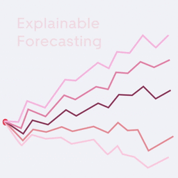
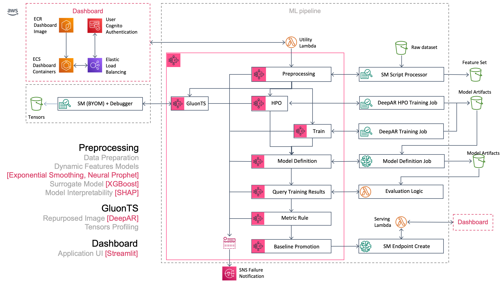
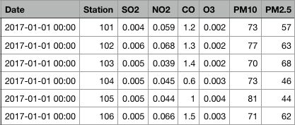

<br /><br /><br />
<p align="center">
  
</p><br /><br />

# explainable-self-adaptive-forecasting
> A tool for interpreting & unlocking the inner workings of time-series forecasting.

<video width="960" height="540" controls>
  <source src="assets/EASF.mp4" type="video/mp4">
</video>

[](contributing.md)
[](https://s3-us-west-2.amazonaws.com/codefactory-us-west-2-prod-default-build-badges/passing.svg)

Current version: **1.0.0**

Lead Maintainer: [Paul Barna](mailto:barnapb@amazon.com)

## 📋 Table of content

 - [Installation](#-install)
 - [Metrics](#-metrics)
 - [Description](#-description)
 - [Deployment and Usage](#-deployment-and-usage)
 - [Example](#-example)
 - [See also](#-see-also)

## 🚀 Install

In order to add this block, head to your project directory in your terminal and add it using NPM.

```bash
npm install @aws-blocks/explainable-self-adaptive-forecasting-tool
```

> ⚠️ You need to have the [AWS SAM CLI](https://docs.aws.amazon.com/serverless-application-model/latest/developerguide/serverless-sam-cli-install.html) installed on your deployment machine before installing this package with version >= **2.1.16**, [DOCKER](https://docs.docker.com/engine/install/) version >= **20.10.0** and [PIP](https://pip.pypa.io/en/stable/installing/) >= **20.3.3**.

The `explainable-self-adaptive-forecasting` project will be available in the `node_modules/@aws-blocks` directory. 

## 📊 Metrics

The below metrics displays approximate values associated with deploying and using this block.

Metric | Value
------ | ------
**Type** | Solution
**Installation Time** | ~ 30 minutes (due too the additional time required to execute a full docker pipeline run ~15min)
**Audience** | Applied Scientists, Research Scientists, Data Scientists, ML Scientists, ML Specialists
**Requirements** | [aws-sam](https://docs.aws.amazon.com/serverless-application-model/latest/developerguide/serverless-sam-cli-install.html), [Docker](https://docs.docker.com/engine/install/)

## 🔰 Description

This block builds the infrastructure required to run a tool for interpreting & unlocking the inner workings of time-series forecasting.

For more context into where and how to use the tool, please read the `Narrative` and the `Manual` under the `assets/` folder.

**Model interpretability**
 
Explaining feature importance and accumulated local effects, using SHAP, a game theoretic approach to explain the output of any machine learning model.
By using the XGBoost surrogate model to compute the full SHAP values, the user would be able to run a comprehensive set of analysis and understand both global and local contributions for each sample-prediction pair.
By capturing tensors while training (gradients and weights distributions), a complete understanding is achieved on how the network performs and how to tune it accordingly.

**Self-Adaptive Covariates**


A design of embedded self-attention signals learning accumulated local effects which grow over time, group level effects, as well as improving the target’s best realisation.

A novel approach for use cases where:

- [x] accumulated local effects [which grow over time] shall not be disregarded or attributed to noise
- [x] non-stationarity is a known factor [explicitly modelled as part of the null hypothesis]
- [x] group-level effects shall not be lost within the overall predictive distribution
- [x] missing data [large gaps] shall not compromise the learning of a progressive underlying process
- [x] the best target realisation [univariately built multi-step projection] carries a high degree of predictability

**Neural Forecasting**
 
A state-of-the-art Autoregressive Recurrent Network for multi-step forecasts of multiple-related time series. [DeepAR].
A neural approach for use cases where:

- [x] interested in the full predictive distribution, not just the single best realisation
- [x] there is significant uncertainty growth over time from the data
- [x] widely-varying scales which requires rescaling and velocity-based sampling

**Probabilistic Estimates**

Estimating the probability distribution of a time series’ future given its past. 
This is achieved in the form of Monte Carlo samples, by computing quantile estimates for all sub-ranges in the prediction horizon.

### Architecture Diagram

<p align="center">
  
</p>

## 🛠 Deployment and Usage


Deploy the package using the bash_utility.sh providing the settings for deployment.

**Linux/MacOs**

> ⚠️  The two following stacks require different names.

Deploy the docker pipeline stack `@aws-blocks/docker-pipeline` using the line below, which will create a new ECR repository, builds the Preprocessing Docker Image and automatically pushes it to the created repository.

```sh
npm run build --stack_name=<stack_name> --ecr_repository=<ecr_repository> --region=<region> --bucket_backend=<bucket_backend>
```
Check the pipeline is finished (navigate to CodePipeline within the AWS console) [`15 min waiting time`]

Once successfully executed, deploy the app stack, which will create both the backend and the dashboard resources. [`15 min waiting time`]

```sh
npm run deploy --stack_name=<stack_name> --ecr_repository=<ecr_repository> --dashboard_ecr_repository=<dashboard_ecr_repository> --region=<region> --bucket_backend=<bucket_backend> --dashboard_name=<dashboard_name> --email=<email>
```
Upon completion of the deploymnet script, a mail should have been received with a link to the ECS hosted app, alongside the initial credentials.
Next step, spin up the ECS tasks with the following command:

```sh
aws ecs update-service --cluster <dashboard_name --service <dashboard_name> --desired-count 2 > /dev/null
```
Wait until tasks are provisioned, than paste the link you received by email (New Dashboard Account) into the browser.
 
Please change the password when you first log in.

As instructed within the `Manual`, when the app is first launched, most layouts are not available, as a complete pipeline execution is required beforehand. 
For that, please go first to the `Configuration Page` and review the parameters/hyperparameters values, submit the changes if there are any.
Second, navigate to the `Pipeline Page`, enable the `Training Option` (set to “True”) and click the `Run` Button. Wait until the execution is completed, and now the rest of the layouts should be available, once the data is loaded.

At the end of the session, you can stop the ECS tasks with the following command:

```sh
aws ecs update-service --cluster <dashboard_name --service <dashboard_name> --desired-count 0 > /dev/null
```

**Windows**

TBA

### Deployment Parameters

Name                         | Default value | Type          |Description
---------------------------  | ------------- | ------------- |-----------
**stack-name**               | None          | String        | The name of the app stack.
**ecr-repository**           | None          | String        | The name of the ECR repository where to register the Docker Preprocessing Image.
**dashboard-ecr-repository** | None          | String        | The name of the ECR repository where to register the Docker Dashboard Image.
**region**                   | None          | String        | The region where the backend stack is deployed.
**bucket-backend**           | None          | String        | The bucket where the backend stack artefacts are stored (where the dataset should be stored as well).
**dashboard-name**           | None          | String        | The name of the dashboard (incl. related resources)
**email**                    | None          | String        | Your email address, where the dashboard credentials are set and to subscribe the SNS Failure Topic

## 📟 Example

You can find an example dataset `Air_Pollution_in_Seoul.csv`. It can be used to explore the tool, or as reference for preparing your own dataset.
<br/>

#### The example dataset has the followng structure:

**Time Stamp Column** | **Pivot Colum** | **Feature Columns**

For more details into how to prepare your dataset, please refer to the manual dcoumentation.
Once the app is launched , these fields can be populated accordingly within the Configuration Menu.

<p align="center">
  
</p>


## 👀 See also

 - The [AWS Steps Function](https://docs.aws.amazon.com/step-functions/latest/dg/welcome.html) official documentation.
 - The [SageMaker](https://docs.aws.amazon.com/sagemaker/latest/dg/whatis.html) official documentation.
 - The [ECS](https://docs.aws.amazon.com/AmazonECS/latest/developerguide/Welcome.html) official documentation.
 - The [Cognito](https://docs.aws.amazon.com/cognito/latest/developerguide/cognito-user-identity-pools.html) official documentation.
 - The [SageMaker Dashboard with Streamlit](https://github.com/awslabs/sagemaker-dashboards-for-ml) official documentation.
 - The [DeepAR paper](https://arxiv.org/pdf/1704.04110.pdf) official documentation.
 - The [Neural Prophet](http://neuralprophet.com/) official documentation.
